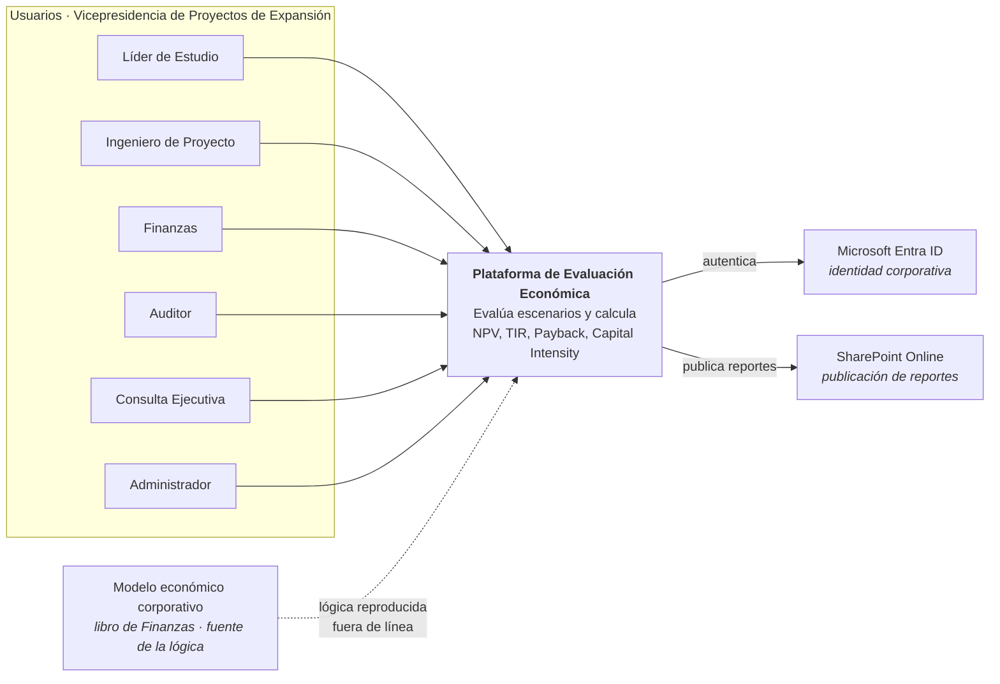
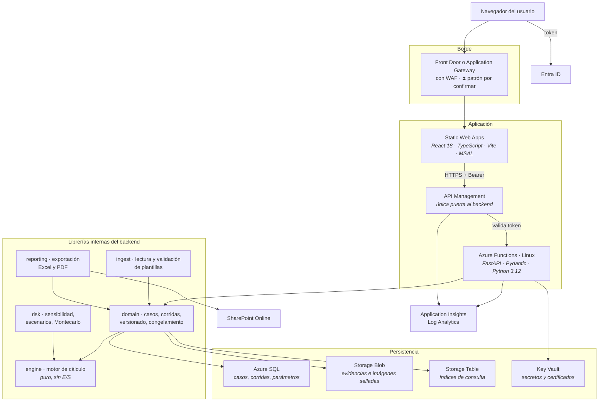
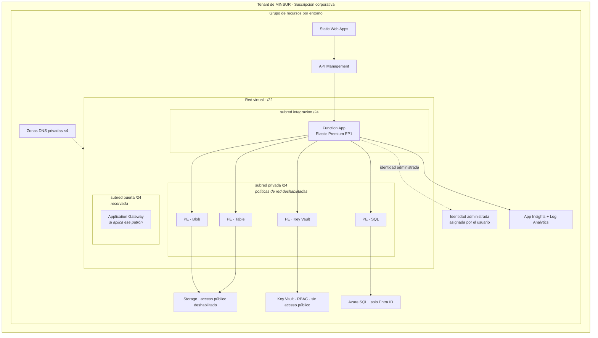
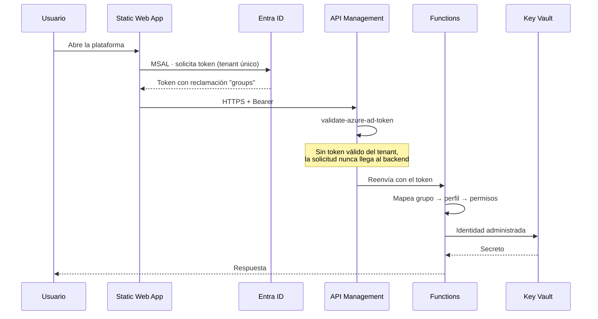
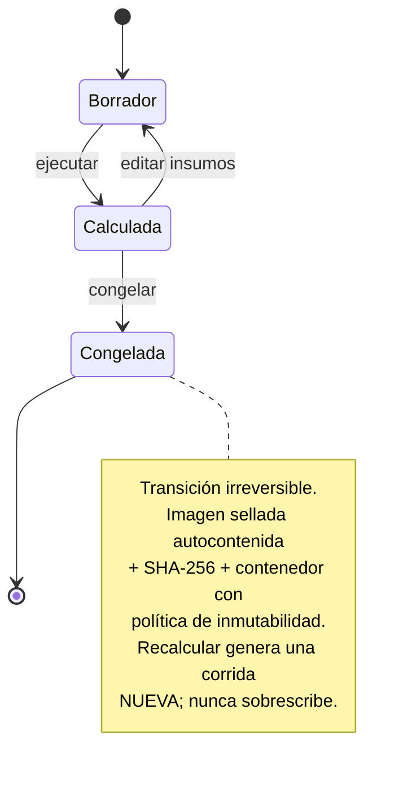
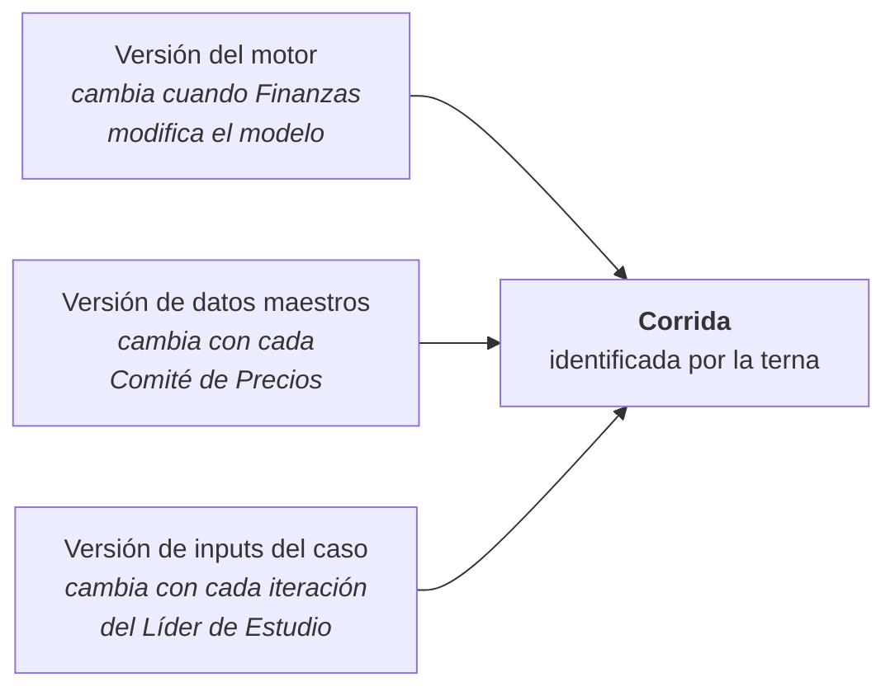
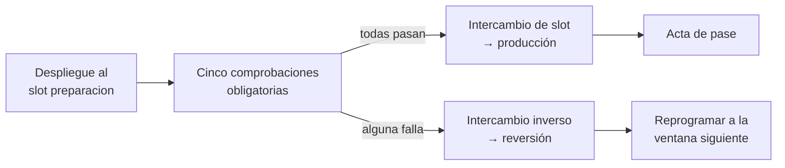

# Artefacto de arquitectura

**Documento** `INVA-01-2026-182-ARQ` · Rev. A
**Solución** Plataforma de Evaluación Económica · Modelo MINSUR
**Elabora** Sergio Martínez, Arquitecto Cloud · INVA
**Dirigido a** Comité de Arquitectura TI & OT · MINSUR
**Fecha** 24/08/2026 · **Actividad** PT6.1 · **CECO** 880001594

> **Estado del documento.** Contenido técnico completo, pendiente de volcado al formato corporativo
> de MINSUR (`R-03`, SOL-01). Todo lo aquí descrito está implementado como infraestructura como
> código en `infra/bicep/` y compila sin advertencias. No son intenciones de diseño: es lo que la
> plantilla despliega.

**Convención de marcado usada en todo el documento:**

| Marca | Significado |
|---|---|
| ✔ **Definido por MINSUR** | Estándar corporativo comunicado en la reunión de arranque |
| ▸ **Propuesta de INVA** | Sujeto a confirmación del comité |
| ⧗ **Pendiente** | Requiere decisión de MINSUR antes del despliegue |

---

## 1. Propósito de la solución

MINSUR evalúa la rentabilidad de sus proyectos de inversión mediante un modelo económico corporativo
administrado por Finanzas: un libro de cálculo que proyecta producción, costos, inversiones e
impuestos a lo largo de la vida de la mina y los convierte en indicadores de rentabilidad.

Durante los estudios de preinversión, el área de Proyectos necesita ejecutar múltiples evaluaciones
y análisis de trade-off. Hoy esas evaluaciones dependen de la disponibilidad de Finanzas, cuyas
prioridades compiten con las solicitudes de Proyectos. El resultado es latencia: menos escenarios
explorables y menor oportunidad de la información para decidir.

La plataforma reproduce la lógica del modelo corporativo en un servicio web, para que Proyectos
ejecute evaluaciones preliminares de forma autónoma, bajo la misma lógica, con trazabilidad completa.

**Tres resultados verificables:** autonomía del área de Proyectos, estandarización del ingreso de
insumos con gobierno centralizado de supuestos, y reproducibilidad auditable de cada evaluación.

Alineada al estándar `DM-STD-PE-27` de Evaluación de la Inversión.

### Dimensionamiento

| Parámetro | Valor |
|---|---|
| Usuarios nominales | 17 |
| Usuarios concurrentes | 7 |
| Perfiles diferenciados | 6 |
| Evaluaciones anuales estimadas | ~100 |
| Tamaño de archivo por evaluación | 1 a 10 MB |
| Retención mínima | 5 años |
| Clasificación de la información | Financiera y confidencial |
| Criticidad declarada | Media |

### Niveles de servicio comprometidos

| Indicador | Objetivo |
|---|---|
| Apertura del tablero | < 5 segundos |
| Evaluación estándar | ⧗ Cifra única pendiente de MINSUR (`R-51`) |
| Disponibilidad en horario laboral | > 99 % |

---

## 2. Vista de contexto



**Fuera de alcance de la integración.** No hay integración automática con sistemas fuente, incluido
SAP. Los insumos ingresan por plantilla Excel elaborada por MINSUR o por captura directa en
formularios web, sobre un mismo esquema de datos.

---

## 3. Vista de contenedores



### Regla de dependencia del backend

```
apps/api  →  domain, ingest, risk, reporting  →  engine  →  (nada interno)
```

**El motor no importa nada del resto del árbol.** No lee Excel, no toca red, no consulta la base de
datos. Recibe estructuras validadas y devuelve series.

No es purismo: es la condición para que una corrida sea función exclusiva de sus entradas, y por
tanto reproducible. Si el motor pudiera leer un archivo o consultar la base, una evaluación
congelada dejaría de poder recalcularse con garantía de obtener el mismo resultado — que es
justamente lo que el alcance exige verificar.

---

## 4. Vista de despliegue



### Inventario de recursos por entorno

| # | Recurso | Tipo | SKU / configuración |
|---|---|---|---|
| 1 | Red virtual | `Microsoft.Network/virtualNetworks` | /22 con 3 subredes /24 |
| 2 | Log Analytics | `Microsoft.OperationalInsights/workspaces` | PerGB2018 |
| 3 | Application Insights | `Microsoft.Insights/components` | Vinculado a Log Analytics |
| 4 | Grupo de acción | `Microsoft.Insights/actionGroups` | Correo de operación |
| 5–6 | Alertas de métrica | `Microsoft.Insights/metricAlerts` | Latencia y fallos |
| 7 | Identidad administrada | `Microsoft.ManagedIdentity/userAssignedIdentities` | Asignada por el usuario |
| 8 | Key Vault | `Microsoft.KeyVault/vaults` | Standard, RBAC, sin red pública |
| 9 | Cuenta de almacenamiento | `Microsoft.Storage/storageAccounts` | StorageV2, sin clave compartida |
| 10 | Servidor SQL | `Microsoft.Sql/servers` | Solo Entra ID |
| 11 | Base de datos | `Microsoft.Sql/servers/databases` | Serverless o aprovisionada |
| 12 | Plan de funciones | `Microsoft.Web/serverfarms` | Elastic Premium EP1 en producción · Flex Consumption en el resto |
| 13 | Function App | `Microsoft.Web/sites` | Python 3.12 |
| 14 | Ranura de preparación | `Microsoft.Web/sites/slots` | Solo producción |
| 15 | API Management | `Microsoft.ApiManagement/service` | Consumption · escala a cero, SLA 99,95 % |
| 16 | Static Web App | `Microsoft.Web/staticSites` | Standard |
| 17–20 | Puntos de conexión privados | `Microsoft.Network/privateEndpoints` | Blob, Table, Vault, SQL |
| 21–24 | Zonas DNS privadas | `Microsoft.Network/privateDnsZones` | Una por servicio |
| 25 | Publicación | Front Door Standard **o** Application Gateway v2 | Configurado en Front Door Standard |

**Cuatro entornos desde una sola plantilla**, diferenciados exclusivamente por parámetros:

| Entorno | Suscripción | Datos | Desde |
|---|---|---|---|
| Construcción | INVA | Sintéticos | 24/08/2026 |
| Desarrollo | MINSUR | Sintéticos y contraste | 09/09/2026 (H10) |
| Calidad | MINSUR | Contraste real, control de Finanzas | 18/09/2026 (H11) |
| Producción | MINSUR | Evaluaciones reales | 12/10/2026 (H8) |

> **Configuración manual prohibida en todo entorno del cliente.** Es la garantía de que el entorno
> homologado en calidad y el productivo no puedan divergir, y de que el pase sea reproducible.

---

## 5. Identidad y control de acceso



### Los seis perfiles

| Perfil | Grupo de seguridad ▸ | Alcance funcional |
|---|---|---|
| Administrador | `SG-MINSUR-EVALECO-ADMIN` | Configuración, parámetros maestros, usuarios |
| Finanzas | `SG-MINSUR-EVALECO-FINANZAS` | Versión del motor, Comités de Precios, certificación |
| Líder de Estudio | `SG-MINSUR-EVALECO-LIDER` | Crear, editar, ejecutar y congelar evaluaciones |
| Ingeniero de Proyecto | `SG-MINSUR-EVALECO-INGENIERO` | Cargar insumos y ejecutar evaluaciones |
| Consulta Ejecutiva | `SG-MINSUR-EVALECO-EJECUTIVO` | Solo lectura de tablero y resultados |
| Auditor | `SG-MINSUR-EVALECO-AUDITOR` | Solo lectura del historial y la bitácora |

### Permisos solicitados a Microsoft Graph

▸ **Propuesta de INVA:** un solo permiso delegado, `User.Read`.

| Enfoque | Permiso | Superficie de acceso |
|---|---|---|
| **Propuesto**: reclamación `groups` en el token | `User.Read` | Solo el perfil del usuario autenticado |
| Alternativo: consulta a Graph | `GroupMember.Read.All` | Lectura de toda la membresía del tenant |

Con seis grupos y diecisiete usuarios, la reclamación en el token es suficiente y queda muy por
debajo del límite de sobrecarga de 200 grupos. La propuesta **reduce el permiso solicitado** frente
a lo previsto originalmente en el Plan de Trabajo.

### Principios de identidad aplicados

| Principio | Implementación |
|---|---|
| Sin credenciales en código | Identidad administrada asignada por el usuario, en todos los accesos |
| Sin claves de cuenta | `allowSharedKeyAccess = false` en almacenamiento |
| Sin contraseña de base de datos | `azureADOnlyAuthentication = true`; administrador es un **grupo** |
| Sin secreto de despliegue | Federación de identidades de carga de trabajo |
| Privilegio mínimo | Contributor acotado al grupo de recursos, nunca a la suscripción |
| Sin acceso permanente a producción | INVA despliega por canalización, no por acceso interactivo |

> Un servicio que no tiene contraseña no puede filtrarla. Esa es la razón de las tres primeras
> filas, y no una preferencia estilística.

---

## 6. Red y perímetro

### Matriz de flujos

| # | Origen | Destino | Puerto | Protocolo | Justificación |
|---|---|---|---|---|---|
| 1 | Internet corporativa | Front Door / App Gateway | 443 | HTTPS | Acceso de usuarios |
| 2 | Borde | Static Web App | 443 | HTTPS | Entrega de la interfaz. Contenido estático, sin datos ni secretos |
| 3 | Navegador | Entra ID | 443 | HTTPS | Autenticación MSAL |
| 4 | Navegador | API Management | 443 | HTTPS | Llamadas a la API |
| 5 | API Management | Function App | 443 | HTTPS | Reenvío al backend |
| 6 | Function App | Storage (blob, table) | 443 | HTTPS | Punto de conexión privado |
| 7 | Function App | Key Vault | 443 | HTTPS | Punto de conexión privado |
| 8 | Function App | Azure SQL | 1433 | TDS | Punto de conexión privado |
| 9 | Function App | Entra ID | 443 | HTTPS | Validación de token e identidad |
| 10 | Function App | Application Insights | 443 | HTTPS | Telemetría |
| 11 | Function App | SharePoint Online | 443 | HTTPS | Publicación de reportes |
| 12 | Agente de despliegue | Recursos del grupo | 443 | HTTPS | Aprovisionamiento y despliegue |

### Controles de perímetro

| Control | Estado |
|---|---|
| Acceso público al almacenamiento | Deshabilitado |
| Acceso público a Key Vault | Deshabilitado |
| Acceso público a Azure SQL | Deshabilitado |
| Backend accesible solo desde APIM | Restricción por etiqueta de servicio `ApiManagement` |
| Origen accesible solo desde el borde | Restricción por `AzureFrontDoor.Backend` en `staticwebapp.config.json` |
| Cabeceras de seguridad del contenido | CSP, HSTS, `X-Frame-Options: DENY`, `nosniff` |
| Todo el tráfico de salida por la red virtual | `WEBSITE_VNET_ROUTE_ALL = 1` |
| TLS mínimo | 1.2 en todos los servicios |
| Cifrado de infraestructura en almacenamiento | Habilitado |

### Direccionamiento ▸

```
Desarrollo  10.60.0.0/22    Calidad  10.61.0.0/22    Producción  10.62.0.0/22

Cada red se divide en tres subredes /24:
  integracion   delegada a Microsoft.Web/serverFarms
  privada       puntos de conexión privados
  puerta        reservada para Application Gateway
```

⧗ **Decisión pendiente.** La subred `puerta` se reserva aunque el patrón elegido sea Front Door.
Cambiar de patrón después no debe obligar a redireccionar espacio ya en uso.

### Patrón de publicación ⧗

La infraestructura soporta **ambos patrones sin modificar la aplicación**:

| | Front Door Standard | Application Gateway v2 |
|---|---|---|
| Ubicación | Servicio de borde global | Dentro de la red virtual |
| WAF | Reglas propias · tasa y métodos | OWASP 3.2 |
| Acceso al origen | Público, contenido estático | Directo dentro de la red |
| Costo estimado por entorno | ~US$ 35/mes | ~US$ 250/mes + IP pública |

Se solicita al comité indicar cuál exige el estándar corporativo. **Ahora es un cambio de
parámetro; en septiembre implica rehacer esta revisión.**

---

## 7. Gobierno del dato

### Clasificación y ubicación

| Dato | Clasificación | Ubicación |
|---|---|---|
| Evaluaciones y corridas | Financiera y confidencial | Azure SQL + Blob |
| Imágenes selladas de corridas congeladas | Financiera y confidencial | Blob, contenedor inmutable |
| Plantillas de insumos | Interna | Blob |
| Bitácora de auditoría | Interna, solo escritura | Table |
| Parámetros maestros | Interna | Azure SQL |
| Reportes exportados | Financiera y confidencial | SharePoint Online |

### Congelamiento e inmutabilidad

El alcance exige que una evaluación usada como sustento de decisión se preserve de forma
**permanente e inmutable**, y que ni un administrador de la plataforma ni uno de la suscripción
puedan alterarla.



| Elemento | Implementación |
|---|---|
| Retención | 1825 días (5 años) sobre el contenedor de imágenes selladas |
| Inmutabilidad | Política basada en tiempo, con escritura por anexado permitida |
| Sello criptográfico | SHA-256 sobre la imagen autocontenida |
| Versionado de blobs | Habilitado |
| Borrado lógico | 90 días, blobs y contenedores |
| Ciclo de vida | Solo cambia el nivel de acceso. **No borra**: con inmutabilidad no podría |

> **Punto que requiere decisión del comité.** La plantilla crea la política de inmutabilidad
> **desbloqueada**. Bloquearla es irreversible: no puede reducirse ni eliminarse durante los cinco
> años. INVA propone ejecutar el bloqueo como paso explícito del pase a producción, con TI presente
> y registro en el acta. **Hasta que se ejecute, el requisito está implementado pero no
> garantizado.**

### Versionado en tres ejes

Una evaluación queda definida por la combinación exacta de tres versiones que cambian a ritmos
distintos y por decisión de actores distintos:



**Consecuencia operativa exigida por el alcance:** cuando Finanzas publica una nueva versión del
modelo, las corridas anteriores conservan su vínculo con la versión que las calculó y no se alteran.
Las versiones del motor coexisten en producción.

### Auditoría

Bitácora de solo escritura, accesible al perfil Auditor. Cada registro contiene identificador de
corrida, usuario, marca de tiempo, acción y —ante modificación de insumos o parámetros— los valores
anterior y posterior.

**La reproducibilidad se verifica de forma activa, no se presume.** Una función programada recalcula
una muestra de corridas congeladas desde su imagen sellada y compara con el resultado sellado.
Cualquier divergencia se reporta como incidente.

---

## 8. Observabilidad y continuidad

| Ámbito | Implementación |
|---|---|
| Telemetría | Application Insights sobre Log Analytics |
| Retención de registros | 30 días (dev) · 90 (calidad) · 365 (producción) |
| Alerta de latencia | Solicitudes sobre 5 000 ms · severidad 2 |
| Alerta de disponibilidad | Más de 5 solicitudes fallidas en 15 min · severidad 1 |
| Trazas de APIM | Correlación W3C, muestreo al 100 % |
| Auditoría de SQL | Habilitada hacia Azure Monitor |

### Respaldo y recuperación

| Elemento | Producción | Calidad / Desarrollo |
|---|---|---|
| Redundancia de almacenamiento | GZRS (zona + geográfica) | ZRS / LRS |
| Respaldo de base de datos, corto plazo | 35 días | 7 días |
| Respaldo de base de datos, largo plazo | 4 semanas · 12 meses · **5 años** | — |
| Restauración de blobs a un punto en el tiempo | 89 días | 89 días |

⧗ Se solicita al comité confirmar los objetivos de punto de recuperación (RPO) y de tiempo de
recuperación (RTO) acordes a la criticidad media declarada.

### Estrategia de pase y reversión



**Las cinco comprobaciones**, ejecutadas dentro de la ventana de mantenimiento:

1. Autenticación efectiva con una cuenta de cada uno de los seis perfiles
2. Caso base de contraste dentro de la tolerancia certificada
3. Tablero y estados financieros dentro del nivel de servicio
4. Exportación a Excel y publicación en SharePoint
5. Registro en el historial con su bitácora de auditoría

**Revertir es un intercambio de slot, no un redespliegue.** Dentro de una ventana de seis horas esa
diferencia decide si se alcanza a revertir. La infraestructura no se toca: es idempotente y está
codificada.

Ventana: domingo **11/10/2026**, 00:00 a 06:00. El despliegue demanda ~2 horas y deja 4 de margen.
Como es un despliegue inicial y no una migración, no hay corte de servicio ni pérdida de datos
preexistentes.

---

## 9. Seguridad del ciclo de desarrollo

| Fase | Control | Herramienta |
|---|---|---|
| Cada integración | Análisis estático | Bandit *(CodeQL si MINSUR licencia GHAzDO)* |
| Cada integración | Dependencias | pip-audit, pnpm audit |
| Cada integración | Calidad y seguridad de código | SonarQube |
| Nocturno sobre calidad | Análisis dinámico | OWASP ZAP |
| Antes del pase | Postura de nube | Defender for Cloud, Azure Policy |
| 21/09 al 02/10 | **Ethical hacking** | Seguridad de la Información, MINSUR |

Los controles corren **desde la semana del 7 de septiembre**, no en la homologación. El objetivo es
que los hallazgos aparezcan durante la construcción y no en la semana del 5 de octubre, que tiene
cuatro días hábiles por el feriado del 8 y no admite reprogramación.

### Criterio de salida propuesto ▸

| Severidad | Tratamiento |
|---|---|
| Crítica y Alta | Remediación obligatoria antes del pase. Bloquean H7 |
| Media y Baja | Se registran, se acuerda plan y se difieren a la estabilización |

> Sin este escalonamiento, cualquier vulnerabilidad menor en una librería de terceros detiene el
> pase. En la reunión de arranque se advirtió que con Python eso es frecuente, y se planteó
> priorizar críticas y altas. Esta propuesta formaliza ese planteamiento.

---

## 10. Decisiones de arquitectura

| # | Decisión | Alternativa descartada | Razón |
|---|---|---|---|
| 1 | Python 3.12 | .NET/C# (estándar corporativo) | ✔ Confirmado en el KOM. Madurez del ecosistema numérico para cálculo financiero y simulación. Requiere constancia de excepción (`R-14`) |
| 2 | Elastic Premium **solo en producción** | Flex Consumption en los cuatro entornos | Flex cubre de sobra a siete usuarios y cuesta una fracción, pero no ofrece ranuras de despliegue. Sin ellas, revertir el pase deja de ser un intercambio de segundos dentro de una ventana de seis horas |
| 3 | Azure Functions | Container Apps | ▸ Integración nativa con identidad administrada; el patrón de carga son ráfagas de cómputo, no carga sostenida |
| 4 | API Management **Consumption** | Standard v2 · Basic v2 · Developer | ✔ La puerta es estándar de MINSUR y permite validar el token antes del backend. El nivel Consumption conserva el SLA de 99,95 %, escala a cero y no factura el primer millón de llamadas. Requiere la carga directa al almacenamiento |
| 5 | Solo Entra ID en Azure SQL | Usuario administrador con contraseña | Elimina un secreto que custodiar |
| 6 | Sin clave compartida en almacenamiento | Cadena de conexión | Fuerza el acceso por identidad; hace verificable la ausencia de credenciales |
| 7 | Motor puro, sin E/S | Motor con acceso a datos | Condición para que una corrida sea función de sus entradas, y por tanto reproducible |
| 8 | Inmutabilidad a nivel de contenedor | Atributo de solo lectura en la aplicación | El alcance exige que ni un administrador de suscripción pueda alterar una evaluación congelada |
| 9 | Bicep | Terraform | ▸ Sin estado externo que custodiar; soporte nativo de Azure y de `what-if` contra Azure Policy |
| 10 | Carga y descarga directas al almacenamiento | Archivos que atraviesan la puerta y el cómputo | Firma de delegación de usuario de corta vigencia. Evita ocupar memoria con megabytes de Excel, elimina un límite de tamaño en la puerta y reduce la latencia. El nombre del blob lo fija el servidor, nunca el cliente |
| 11 | Federación de identidades | Secreto de cliente | No hay secreto de despliegue que rotar o filtrar |

---

## 11. Costos de consumo

El consumo de Azure corre por cuenta de MINSUR conforme al alcance, de modo que la elección de SKU
es una decisión con impacto directo en el cliente. Las cifras salen de un modelo reproducible,
`scripts/modelo_costos.py`, que parte del dimensionamiento declarado —17 usuarios, 7 concurrentes,
~100 evaluaciones al año, archivos de 1 a 10 MB— y aplica precios de lista de East US 2, sin
descuentos de acuerdo empresarial.

> **El servicio es pequeño y el dimensionamiento lo refleja.** Cien evaluaciones al año de hasta
> 10 MB acumulan 4,9 GB en cinco años, y siete usuarios concurrentes generan del orden de doscientas
> mil llamadas al mes. Ninguna de esas cifras se acerca a los umbrales que justifican capacidad
> reservada. Por eso la arquitectura usa servicios que **facturan por uso y escalan a cero** allí
> donde no compromete una garantía del alcance, y capacidad fija solo donde sí la compromete.

### Configuración desplegada

| Componente | Producción | Calidad | Desarrollo |
|---|---|---|---|
| API Management `Consumption` | 0 | 0 | 0 |
| Cómputo | 150 · EP1 | 1 · Flex | 0 · Flex |
| Azure SQL serverless | 81 · con pausa | 81 · con pausa | 5 · esporádica |
| Front Door `Standard` | 35 | 35 | 0 · sin borde |
| Puntos de conexión privados (4) | 29 | 29 | 12 |
| Observabilidad con tope diario | 11 | 6 | 2 |
| Static Web Apps | 9 | 9 | 0 · Free |
| Almacenamiento y Key Vault | 2 | 1 | 1 |
| **Total mensual (USD)** | **317** | **162** | **19** |

**Total de los tres entornos del cliente: ~US$ 498/mes · ~US$ 5 977/año.** El entorno de
construcción de INVA no se incluye: lo asume el proveedor.

### Las cuatro decisiones que producen esa cifra

| # | Decisión | Por qué |
|---|---|---|
| 1 | **API Management Consumption** en los cuatro entornos | Escala a cero, factura por llamada y no cobra el primer millón mensual. Conserva el acuerdo de nivel de servicio de **99,95 %**, con holgura sobre el compromiso de >99 % en horario laboral del alcance. Con diecisiete usuarios, ese primer millón no se alcanza |
| 2 | **Cómputo Flex**, salvo en producción | Flex cubre de sobra a siete usuarios concurrentes. Producción se mantiene en Elastic Premium porque Flex no ofrece ranuras de despliegue, y sin ellas revertir el pase deja de ser un intercambio de segundos dentro de una ventana de seis horas |
| 3 | **Azure SQL serverless con pausa** y calentamiento programado | La base está inactiva la mayor parte del tiempo. Sin pausa, serverless factura el mínimo de 0,5 vCore las 730 horas del mes *más* el consumo por encima de ese mínimo, y resulta más caro que la capacidad aprovisionada equivalente. Con pausa a los 60 minutos y un calentamiento que la mantiene activa de 07:00 a 18:00 en días hábiles, no hay latencia de reanudación dentro del horario de uso |
| 4 | **Entorno de desarrollo efímero** | La infraestructura como código es idempotente y los insumos de ese entorno son sintéticos. Se crea cuando hay un ciclo de cambio y se destruye al terminar. Con la puerta de enlace en Consumption el ciclo toma minutos; con el SKU Developer tardaba entre 30 y 45 |

### El requisito que lo habilita

Las plantillas de Producción, CAPEX y OPEX pesan entre 1 y 10 MB, y el nivel Consumption limita el
tamaño del cuerpo que las políticas pueden almacenar.

**La carga se resuelve con una firma de acceso compartido de corta vigencia:** la interfaz pide a la
API una autorización temporal y sube el archivo **directamente al almacenamiento**, sin que
atraviese la puerta de enlace ni los servicios de aplicación. Las exportaciones a Excel y PDF se
descargan por el mismo mecanismo.

No es una concesión para abaratar: es el patrón correcto con cualquier SKU. Evita ocupar memoria de
cómputo con megabytes de Excel, elimina un límite de tamaño en la puerta y reduce la latencia de
carga. El nombre del blob lo fija el servidor y nunca el cliente, la firma dura quince minutos y su
permiso se acota a un solo archivo.

Implementación: `packages/domain/src/minsur_domain/carga_directa.py`.

### El borde: Front Door Standard

El borde de la plataforma es **Front Door Standard**, con cortafuegos de aplicación configurado
mediante reglas propias: limitación de tasa por origen y bloqueo de los métodos HTTP que la interfaz
no utiliza.

El origen no queda expuesto: `staticwebapp.config.json` restringe el acceso al Static Web App a la
etiqueta de servicio `AzureFrontDoor.Backend`, de modo que el hostname `*.azurestaticapps.net` no
responde a tráfico que no venga del borde. Sin esa restricción, cualquiera podría alcanzar el origen
directamente y saltarse el cortafuegos.

Lo sostienen dos hechos sobre lo que ese borde publica. El contenido servido es **estático**
—JavaScript y HTML compilados, sin datos ni secretos—, y los datos no pasan por ahí: viajan por la
puerta de enlace, donde el token de Entra ID se valida antes de alcanzar el backend y la tasa está
limitada por usuario. El conjunto de reglas gestionado que ofrece el nivel Premium protege contra
vectores que aplican a una aplicación que sirve contenido dinámico desde el borde, que no es el caso.

> Se aplica el mismo SKU en producción y en calidad de forma deliberada: **el ethical hacking debe
> evaluar la configuración que efectivamente va a producción.** Homologar sobre un borde distinto
> reduciría el valor de esa evaluación.
>
> El SKU permanece como parámetro de la plantilla. Si la política corporativa de MINSUR exige
> conjunto de reglas gestionado sobre todo contenido publicado (`R-22`), el cambio a Premium es una
> línea y no toca la aplicación.

## 12. Riesgos de arquitectura

| Riesgo | Prob. | Impacto | Control gestionado por INVA |
|---|---|---|---|
| Rechazo o condicionamiento de la arquitectura en revisión tardía | Media | Alto | Someterla en la semana del 31/08 y no en la del 28/09. Diseñar desde el inicio con puntos de conexión privados, identidades administradas y Key Vault, que son los requisitos habitualmente exigidos |
| Demora en el consentimiento del administrador de Entra ID | Media | Alto | Solicitud emitida en la primera semana con el permiso exacto y su justificación. Desarrollo del control de acceso contra un tenant de pruebas de INVA |
| Política de red incompatible con el patrón de publicación | Media | Alto | La infraestructura como código soporta ambos patrones sin reescribir la aplicación |
| Hallazgos críticos en el ethical hacking | Baja | Alto | Análisis estático y de dependencias desde la semana del 07/09; paquete de autoevaluación entregado por adelantado |
| Restricción al tratamiento de datos fuera del tenant | Media | Medio | Plan alternativo: contraste íntegro en el entorno de desarrollo del cliente, adelantando su aprovisionamiento al 31/08 |
| Divergencia entre entornos | Baja | Alto | Una sola plantilla para los cuatro entornos, diferenciada solo por parámetros. Configuración manual prohibida |

---

## 13. Decisiones solicitadas al comité

| # | Decisión | Referencia | Límite |
|---|---|---|---|
| 1 | Confirmación del estándar de arquitectura | SOL-03 · `R-11` | 28/08 |
| 2 | Plan de funciones: Elastic Premium en producción, Flex en el resto | SOL-03 | 28/08 |
| 3 | Política sobre datos financieros fuera del tenant | SOL-04 · `R-12` | 28/08 |
| 4 | Estándar de nomenclatura y etiquetado | SOL-06 · `R-21` | 28/08 |
| 5 | Topología de red: dedicada o integrada | SOL-10 · `R-22` | 04/09 |
| 6 | **Patrón de publicación: Front Door o Application Gateway** | SOL-10 · `R-22` | 04/09 |
| 7 | Región corporativa autorizada | SOL-09 · `R-21` | 04/09 |
| 8 | Enfoque de permisos: reclamación `groups` en el token | SOL-15 · `R-26` | 04/09 |
| 9 | Momento del bloqueo de la política de inmutabilidad | SOL-25 · `R-45` | 18/09 |
| 10 | Criterio de salida escalonado por severidad | SOL-19 · `R-29` | 04/09 |
| 11 | Objetivos de recuperación (RPO y RTO) | SOL-25 · `R-45` | 18/09 |

---

## 14. Trazabilidad con el código

Cada afirmación de este documento es verificable contra la infraestructura como código:

| Sección | Archivo |
|---|---|
| Vista de despliegue e inventario | `infra/bicep/main.bicep` |
| Red y direccionamiento | `infra/bicep/modules/red.bicep` |
| Puntos de conexión privados y DNS | `infra/bicep/modules/punto-privado.bicep` |
| Inmutabilidad, retención y ciclo de vida | `infra/bicep/modules/almacenamiento.bicep` |
| Identidad de base de datos y respaldos | `infra/bicep/modules/base-datos.bicep` |
| Secretos y RBAC | `infra/bicep/modules/boveda.bicep` |
| Cómputo, ranura y restricciones de red | `infra/bicep/modules/funciones.bicep` |
| Puerta de enlace y política de token | `infra/bicep/modules/apim.bicep` |
| Observabilidad y alertas | `infra/bicep/modules/observabilidad.bicep` |
| Patrones de publicación | `infra/bicep/modules/publicacion-frontdoor.bicep` · `infra/bicep/modules/publicacion-appgateway.bicep` |
| Diferencias entre entornos | `infra/bicep/envs/*.bicepparam` |
| Ciclo de seguridad | `infra/pipelines/ci.yml` · `infra/pipelines/security-dast.yml` |
| Pase y reversión | `infra/pipelines/cd.yml` · `infra/pipelines/scripts/verificacion_pase.py` |

Estado a la fecha de emisión: **compila sin advertencias** con Bicep 0.46.1, los cuatro archivos de
parámetros validan, y `what-if` se ejecutó contra la suscripción de INVA sin errores de API.

## 15. Conformidad con el estándar de MINSUR

Esta sección contrasta la arquitectura propuesta con el estándar corporativo comunicado por el área
de Arquitectura y Desarrollo en la reunión de arranque del 24 de agosto. Su propósito es que el
comité no encuentre sorpresas y que INVA no descubra una incompatibilidad en septiembre, cuando la
cadena de infraestructura ya no tiene holgura.

### Lo comunicado, y cómo se atiende

| # | Indicación del área de TI | Cómo se atiende | Estado |
|---|---|---|---|
| 1 | El estándar tecnológico corporativo es .NET/C#. Se consultó por su uso y se confirmó Python | La plataforma se construye sobre Python 3.12. Se solicita constancia formal de la excepción (`SOL-05` · `R-14`) | ⧗ Constancia |
| 2 | Frontend como Static Web App, API Management entre frontend y backend, Azure SQL y almacenamiento blob y table, secretos en Key Vault | Los cinco componentes están implementados en ese orden y con esas funciones. API Management es la única vía al backend, restringida por etiqueta de servicio | ✔ Conforme |
| 3 | Azure DevOps para repositorio y versionamiento, Sonar para calidad, canalizaciones entre Dev, QA y producción con aprobaciones | Cinco canalizaciones con Sonar y compuerta de calidad. Las aprobaciones se configuran en los entornos de Azure DevOps; producción exige doble aprobación, TI y Product Owner | ✔ Conforme |
| 4 | Elaborar y aprobar un artefacto de arquitectura antes de que INVA trabaje sobre la infraestructura | Este documento. El contenido técnico está completo y espera el formato corporativo (`SOL-01` · `R-03`). Ningún despliegue en el tenant precede a su aprobación | ⧗ Formato |
| 5 | Todo desarrollo pasa por ethical hacking antes de la salida en vivo, con acuerdo de dos semanas | Ventana del 21 de septiembre al 2 de octubre sobre el entorno de calidad, reservada desde la semana 2 (`SOL-17`). El entorno se libera el 18 de septiembre | ✔ En cronograma |
| 6 | Con Python y librerías de terceros es común que aparezcan vulnerabilidades; priorizar críticas y altas antes de la salida y postergar medias y bajas | La compuerta de las canalizaciones aplica exactamente ese criterio desde la semana del 7 de septiembre, con paquete de autoevaluación entregado por adelantado (`SOL-18`, `SOL-19`) | ✔ Implementado |
| 7 | La salida podría realizarse primero en calidad mientras se completa la evaluación de seguridad | Es la secuencia del cronograma: calidad liberado el 18 de septiembre, evaluación hasta el 2 de octubre, remediación del 5 al 7, homologación el 9 y pase el 12 | ✔ Conforme |

### Tres puntos que pueden generar observación

Las decisiones de dimensionamiento del capítulo 11 son conformes con el patrón que indicó el área de
TI, pero **el patrón describe los componentes, no sus niveles de servicio**. Tres elecciones de
nivel podrían no satisfacer un estándar corporativo que INVA no conoce en detalle. Se declaran aquí,
con su alternativa y su costo, para que el comité decida en una sola sesión y no en dos.

| # | Punto | Por qué podría objetarse | Alternativa | Costo mensual |
|---|---|---|---|---|
| 1 | **API Management en nivel Consumption** | No admite integración con red virtual. Si el estándar exige que la puerta de enlace opere en modo interno dentro de la red, este nivel no lo permite. Es el punto de mayor exposición de los tres | Standard v2, único nivel con integración de red virtual saliente | +701 |
| 2 | **Front Door en nivel Standard** | El cortafuegos opera con reglas propias y no con el conjunto gestionado. Si la línea base de aseguramiento exige conjunto gestionado sobre todo contenido publicado, no se satisface | Premium, con conjunto gestionado y enlace privado al origen | +295 por entorno |
| 3 | **Base de datos con pausa automática** | Introduce una latencia de reanudación de 30 a 60 segundos fuera de la ventana de calentamiento. Si el estándar exige disponibilidad sin latencia variable, no se satisface | Capacidad aprovisionada de 1 vCore, con reserva anual | +42 |

> **Los tres cambios son parámetros de la plantilla y ninguno toca la aplicación.** Adoptarlos
> después de aprobado el artefacto, en cambio, obliga a volver al comité, y esa cadena tiene holgura
> cero.
>
> Por eso se solicita resolverlos en la misma sesión de presentación. Si el comité objetara los tres,
> el costo mensual pasaría de ~US$ 498 a ~US$ 1 790: la optimización desaparecería casi por completo,
> pero la arquitectura seguiría siendo la misma y el cronograma no se movería.

### Una asimetría que INVA declara por cuenta propia

El entorno de calidad usa cómputo Flex y producción usa Elastic Premium. Es una diferencia
deliberada —producción necesita las ranuras de despliegue que hacen reversible el pase— pero
introduce una asimetría con el principio que este documento sostiene en otros puntos: **el ethical
hacking debe evaluar la configuración que va a producción**.

El alcance de esa asimetría es acotado. La evaluación de seguridad examina la aplicación, el borde y
la superficie expuesta, y los tres son idénticos en ambos entornos. Lo que difiere es el plan de
hospedaje, cuya superficie administrativa no es la que se somete a la evaluación.

Aun así, si Seguridad de la Información prefiere entornos idénticos, igualar calidad a Elastic
Premium cuesta **US$ 149 al mes** y es un parámetro. INVA lo señala en lugar de esperar a que
aparezca como observación.

### Lo que no depende de esta arquitectura

Cuatro definiciones siguen abiertas del lado de MINSUR y ninguna se resuelve con una decisión de
diseño. Están detalladas en el documento de solicitudes formales `INVA-01-2026-182-SOL`:

| Definición pendiente | Referencia | Qué bloquea |
|---|---|---|
| Estándar de nomenclatura y etiquetado | `SOL-06` · `R-21` | Un etiquetado obligatorio faltante hace que la política corporativa rechace el despliegue completo |
| Topología de red: dedicada o integrada a la corporativa | `SOL-10` · `R-22` | Determina si INVA crea la red o consume subredes existentes |
| Identificador del grupo administrador de la base de datos | `SOL-21` · `R-25` | Sin él la base se despliega con un administrador inexistente |
| Definiciones de Azure Policy sobre la suscripción destino | `SOL-02` · `R-04` | Permite validar la plantilla antes de solicitar aprovisionamiento |

### Conclusión

**La arquitectura satisface el patrón de componentes que indicó el área de TI en su totalidad:**
Static Web App, API Management entre frontend y backend, Azure SQL, almacenamiento blob y table,
Key Vault, Azure DevOps con Sonar y aprobaciones por ambiente, artefacto previo al aprovisionamiento,
ethical hacking con acuerdo de dos semanas y criterio escalonado por severidad.

Lo que no puede confirmarse sin la línea base de aseguramiento técnico (`SOL-22` · `R-42`) son los
tres niveles de servicio declarados arriba. **Los tres se resuelven con un parámetro y ninguno
afecta al cronograma si se decide en la sesión de presentación del artefacto.** Decidirlos después
es lo que sí lo afectaría.
